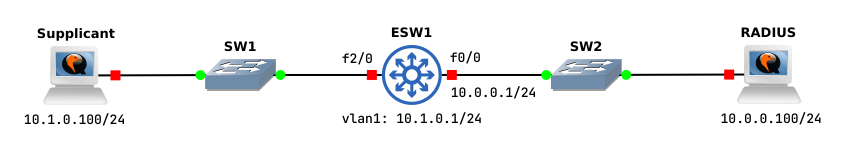

# 802.1X and RADIUS



## Supplicant

## Authenticator (ESW1)

```
configure terminal

interface vlan1
ip address 10.1.0.1 255.255.255.0
no shutdown
no autostate

interface f0/0
ip address 10.0.0.1 255.255.255.0
no shutdown
```

### Enable 802.1X

```
configure terminal

aaa new-model
aaa authentication dot1x default group radius
dot1x system-auth-control
radius-server host 10.0.0.100 auth-port 1812 key supersecretpassword
interface FastEthernet2/0
dot1x port-control auto
```
