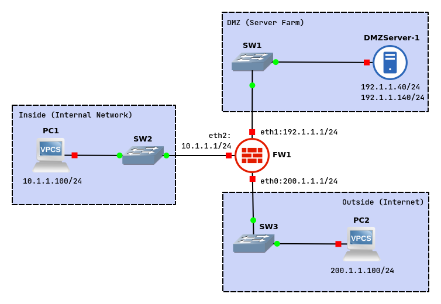

# Introduction to Firewall Deployment



## VPC1

Configure PC1 with the following:
> 10.1.1.100 255.255.255.0 gateway 10.1.1.1

```
ip 10.1.1.100/24 10.1.1.1
```

## VPC2

Configure PC2 with the following:
> 200.1.1.100 255.255.255.0 gateway 200.1.1.1

```
ip 200.1.1.100/24 200.1.1.1
```

## DMZ Server

Configure DMZ Server with 2 IP addresses:
> 192.1.1.40 255.255.255.0 gateway 192.1.1.1
> 192.1.1.140 255.255.255.0 gateway 192.1.1.1

## VyOS Firewall

### Configure interfaces

```
configure

set interfaces ethernet eth0 address 200.1.1.1/24
set interfaces ethernet eth1 address 192.1.1.1/24
set interfaces ethernet eth2 address 10.1.1.1/24

commit
save
```

### Configure NAT/PAT

```
configure

set nat source rule 100 outbound-interface eth0
set nat source rule 100 source address 10.1.1.0/24
set nat source rule 100 translation address 192.1.0.1-192.1.0.10

commit
save
```

### Network security zones

```
configure

set zone-policy zone INSIDE description "Inside (Internal Network)"
set zone-policy zone INSIDE interface eth2
set zone-policy zone DMZ description "DMZ (Server Farm)"
set zone-policy zone DMZ interface eth1
set zone-policy zone OUTSIDE description "Outside (Internet)"
set zone-policy zone OUTSIDE interface eth0

commit
save
```

### Allow Inside equipment to ping Outside devices

Configure the firewalls chains and rules to allow the Inside equipment to ping all Outside devices.

```
configure

set firewall name FROM-INSIDE-TO-OUTSIDE rule 10 description "Accept ICMP Echo Request"
set firewall name FROM-INSIDE-TO-OUTSIDE rule 10 action accept
set firewall name FROM-INSIDE-TO-OUTSIDE rule 10 protocol icmp
set firewall name FROM-INSIDE-TO-OUTSIDE rule 10 icmp type 8
set firewall name TO-INSIDE rule 10 description "Accept Established-Related Connections"
set firewall name TO-INSIDE rule 10 action accept
set firewall name TO-INSIDE rule 10 state established enable
set firewall name TO-INSIDE rule 10 state related enable
set zone-policy zone INSIDE from OUTSIDE firewall name TO-INSIDE
set zone-policy zone OUTSIDE from INSIDE firewall name FROM-INSIDE-TO-OUTSIDE

commit
save
```

### Allow Inside devices to ping DMZ devices

Configure the firewalls chains and rules to allow the Inside devices to ping all DMZ (network 192.1.1.0/24) devices.

```
configure

set firewall name FROM-INSIDE-TO-DMZ rule 10 description "Accept ICMP Echo Request"
set firewall name FROM-INSIDE-TO-DMZ rule 10 action accept
set firewall name FROM-INSIDE-TO-DMZ rule 10 protocol icmp
set firewall name FROM-INSIDE-TO-DMZ rule 10 icmp type 8
set firewall name FROM-INSIDE-TO-DMZ rule 10 destination address 192.1.1.0/24
set zone-policy zone INSIDE from DMZ firewall name TO-INSIDE
set zone-policy zone DMZ from INSIDE firewall name FROM-INSIDE-TO-DMZ

commit
save
```

### Allow Outside devices to ping DMZ Server 192.1.1.40

Configure the firewalls chains and rules to allow the Outside devices to ping the DMZ Server (only IP address 192.1.1.40).

```
configure

set firewall name FROM-OUTSIDE-TO-DMZ rule 10 description "Accept ICMP Echo Request"
set firewall name FROM-OUTSIDE-TO-DMZ rule 10 action accept
set firewall name FROM-OUTSIDE-TO-DMZ rule 10 protocol icmp
set firewall name FROM-OUTSIDE-TO-DMZ rule 10 icmp type 8
set firewall name FROM-OUTSIDE-TO-DMZ rule 10 destination address 192.1.1.40
set firewall name FROM-DMZ-TO-OUTSIDE rule 10 description "Accept Established-Related Connections"
set firewall name FROM-DMZ-TO-OUTSIDE rule 10 action accept
set firewall name FROM-DMZ-TO-OUTSIDE rule 10 state established enable
set firewall name FROM-DMZ-TO-OUTSIDE rule 10 state related enable
set zone-policy zone OUTSIDE from DMZ firewall name FROM-DMZ-TO-OUTSIDE
set zone-policy zone DMZ from OUTSIDE firewall name FROM-OUTSIDE-TO-DMZ

commit
save
```

### Allow Outside devices to send UDP packets to 192.1.1.140:8080

Add a new rule to the chain FROM-OUTSIDE-TO-DMZ to allow the Outside devices to send UDP
packets to port 8080 to the DMZ Server (only IP address 192.1.1.140).

```
configure

set firewall name FROM-OUTSIDE-TO-DMZ rule 12 description "Accept UDP-8080"
set firewall name FROM-OUTSIDE-TO-DMZ rule 12 action accept
set firewall name FROM-OUTSIDE-TO-DMZ rule 12 protocol udp
set firewall name FROM-OUTSIDE-TO-DMZ rule 12 destination address 192.1.1.140
set firewall name FROM-OUTSIDE-TO-DMZ rule 12 destination port 8080

commit
save
```

## Exam questions

Keywords: establish, relates, ping to port
