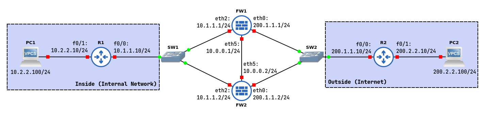

# High-Availability Firewall Scenarios Part 1



## R1 - Router Inside

```
configure terminal
interface f0/0
ip address 10.1.1.10 255.255.255.0
no shutdown
interface f0/1
ip address 10.2.2.10 255.255.255.0
no shutdown
ip route 0.0.0.0 0.0.0.0 10.1.1.2
```

## R2 - Router Outside

```
configure terminal
interface f0/0
ip address 200.1.1.10 255.255.255.0
no shutdown
interface f0/1
ip address 200.2.2.10 255.255.255.0
no shutdown
ip route 192.1.0.0 255.255.254.0 200.1.1.1
ip route 10.0.0.0 255.0.0.0 200.1.1.1
```

## FW1

### Configure name, IPv4 address and static routing

```
configure
set system host-name FW1
set interfaces ethernet eth0 address 200.1.1.1/24
set interfaces ethernet eth2 address 10.1.1.1/24
set interfaces ethernet eth5 address 10.0.0.1/24
set protocols static route 0.0.0.0/0 next-hop 200.1.1.10
set protocols static route 10.2.2.0/24 next-hop 10.1.1.10
commit
exit
```

### Configure NAT/PAT

```
configure
set nat source rule 10 outbound-interface eth0
set nat source rule 10 source address 10.0.0.0/8
set nat source rule 10 translation address 192.1.0.1-192.1.0.10
commit
exit
```

### Configure High-Availability VRRP

```
set high-availability vrrp group FWCluster vrid 10
set high-availability vrrp group FWCluster interface eth5
set high-availability vrrp group FWCluster virtual-address 192.168.100.1/24
set high-availability vrrp sync-group FWCluster member FWCluster
set high-availability vrrp group FWCluster rfc3768-compatibility
```

### Configure conntrack-sync

```
set service conntrack-sync accept-protocol 'tcp,udp,icmp'
set service conntrack-sync failover-mechanism vrrp sync-group FWCluster
set service conntrack-sync interface eth5
set service conntrack-sync mcast-group 225.0.0.50
set service conntrack-sync disable-external-cache
```

### Configure flow control rule

```
set zone-policy zone INSIDE description "Inside (Internal Network)"
set zone-policy zone INSIDE interface eth2
set zone-policy zone OUTSIDE description "Outside (Internet)"
set zone-policy zone OUTSIDE interface eth0

set firewall name FROM-INSIDE-TO-OUTSIDE rule 10 action accept
set firewall name FROM-INSIDE-TO-OUTSIDE rule 10 protocol udp
set firewall name FROM-INSIDE-TO-OUTSIDE rule 10 destination port 5000-6000

set firewall name FROM-OUTSIDE-TO-INSIDE rule 10 action accept
set firewall name FROM-OUTSIDE-TO-INSIDE rule 10 state established enable
set firewall name FROM-OUTSIDE-TO-INSIDE rule 10 state related enable

set zone-policy zone INSIDE from OUTSIDE firewall name FROM-OUTSIDE-TO-INSIDE
set zone-policy zone OUTSIDE from INSIDE firewall name FROM-INSIDE-TO-OUTSIDE
```

## FW2

### Configure name, IPv4 address and static routing

```
configure
set system host-name FW2
set interfaces ethernet eth0 address 200.1.1.2/24
set interfaces ethernet eth2 address 10.1.1.2/24
set interfaces ethernet eth5 address 10.0.0.2/24
set protocols static route 0.0.0.0/0 next-hop 200.1.1.10
set protocols static route 10.2.2.0/24 next-hop 10.1.1.10
commit  
exit
```

### Configure NAT/PAT

```
configure
set nat source rule 10 outbound-interface eth0
set nat source rule 10 source address 10.0.0.0/8
set nat source rule 10 translation address 192.1.0.1-192.1.0.10
commit
exit
```

### Configure High-Availability VRRP

```
set high-availability vrrp group FWCluster vrid 10
set high-availability vrrp group FWCluster interface eth5
set high-availability vrrp group FWCluster virtual-address 192.168.100.1/24
set high-availability vrrp sync-group FWCluster member FWCluster
set high-availability vrrp group FWCluster rfc3768-compatibility
```

### Configure conntrack-sync

```
set service conntrack-sync accept-protocol 'tcp,udp,icmp'
set service conntrack-sync failover-mechanism vrrp sync-group FWCluster
set service conntrack-sync interface eth5
set service conntrack-sync mcast-group 225.0.0.50
set service conntrack-sync disable-external-cache
```

## Notes

### Explain the lack of connectivity after step 3

Since the routing is asymetric, the traffic is flowing from R1 to FW2, from FW2 to R2 and then to R2 to FW1.
The FW1 is blocking the traffic to 10.2.2.100 (VPC1) because the firewalls are not syncing the addresses that are being translated by the NAT mechanism. 
