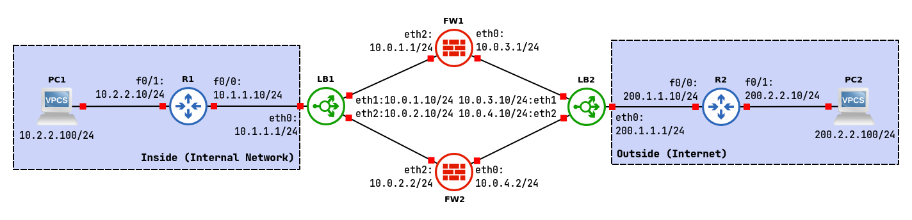

# High-Availability Firewall Scenarios Part 2



## R1 - Router Inside

```
configure terminal
interface f0/0
ip address 10.1.1.10 255.255.255.0
no shutdown
interface f0/1
ip address 10.2.2.10 255.255.255.0
no shutdown

ip route 0.0.0.0 0.0.0.0 10.1.1.1
```

## R2 - Router Outside

```
configure terminal
interface f0/0
ip address 200.1.1.10 255.255.255.0
no shutdown
interface f0/1
ip address 200.2.2.10 255.255.255.0
no shutdown

ip route 0.0.0.0 0.0.0.0 200.1.1.1
```

## LB1

### Configure name, IPv4 address and static routing

```
set system host-name LB1
set interfaces ethernet eth0 address 10.1.1.1/24
set interfaces ethernet eth1 address 10.0.1.10/24
set interfaces ethernet eth2 address 10.0.2.10/24
set protocols static route 0.0.0.0/0 next-hop 10.0.1.1
set protocols static route 0.0.0.0/0 next-hop 10.0.2.2
set protocols static route 10.2.2.0/24 next-hop 10.1.1.10
```

### Configure load balancing service

```
set load-balancing wan interface-health eth1 nexthop 10.0.1.1
set load-balancing wan interface-health eth2 nexthop 10.0.2.2
set load-balancing wan rule 1 inbound-interface eth0
set load-balancing wan rule 1 interface eth1 weight 1
set load-balancing wan rule 1 interface eth2 weight 1
set load-balancing wan sticky-connections inbound
set load-balancing wan disable-source-nat
```

## LB2

### Configure name, IPv4 address and static routing

```
set system host-name LB2
set interfaces ethernet eth0 address 200.1.1.1/24
set interfaces ethernet eth1 address 10.0.3.10/24
set interfaces ethernet eth2 address 10.0.4.10/24
set protocols static route 200.2.2.0/24 next-hop 200.1.1.10
set protocols static route 192.1.0.0/23 next-hop 10.0.3.1
set protocols static route 192.1.0.0/23 next-hop 10.0.4.2
```

### Configure load balancing service

```
set load-balancing wan interface-health eth1 nexthop 10.0.3.1
set load-balancing wan interface-health eth2 nexthop 10.0.4.2
set load-balancing wan rule 1 inbound-interface eth0
set load-balancing wan rule 1 interface eth1 weight 1
set load-balancing wan rule 1 interface eth2 weight 1
set load-balancing wan sticky-connections inbound
set load-balancing wan disable-source-nat
```

## FW1

### Configure name, IPv4 address and static routing

```
set system host-name FW1
set interfaces ethernet eth0 address 10.0.3.1/24
set interfaces ethernet eth2 address 10.0.1.1/24
set protocols static route 0.0.0.0/0 next-hop 10.0.3.10
set protocols static route 10.2.2.0/24 next-hop 10.0.1.10
```

### Configure NAT/PAT mechanism

```
set nat source rule 10 outbound-interface eth0
set nat source rule 10 source address 10.0.0.0/8
set nat source rule 10 translation address 192.1.0.1-192.1.1.254
```

### Configure flow control rule

```
set zone-policy zone INSIDE description "Inside (Internal Network)"
set zone-policy zone INSIDE interface eth2
set zone-policy zone OUTSIDE description "Outside (Internet)"
set zone-policy zone OUTSIDE interface eth0

set firewall name FROM-INSIDE-TO-OUTSIDE rule 10 action accept
set firewall name FROM-INSIDE-TO-OUTSIDE rule 10 protocol udp
set firewall name FROM-INSIDE-TO-OUTSIDE rule 10 destination port 5000-6000

set firewall name FROM-OUTSIDE-TO-INSIDE rule 10 action accept
set firewall name FROM-OUTSIDE-TO-INSIDE rule 10 state established enable
set firewall name FROM-OUTSIDE-TO-INSIDE rule 10 state related enable

set zone-policy zone INSIDE from OUTSIDE firewall name FROM-OUTSIDE-TO-INSIDE
set zone-policy zone OUTSIDE from INSIDE firewall name FROM-INSIDE-TO-OUTSIDE
```

## FW2

### Configure name, IPv4 address and static routing

```
set system host-name FW2
set interfaces ethernet eth0 address 10.0.4.2/24
set interfaces ethernet eth2 address 10.0.2.2/24
set protocols static route 0.0.0.0/24 next-hop 10.0.4.10
set protocols static route 10.2.2.0/23 next-hop 10.0.2.10
```

### Configure NAT/PAT mechanism

```
set nat source rule 10 outbound-interface eth0
set nat source rule 10 source address 10.0.0.0/8
set nat source rule 10 translation address 192.1.0.1-192.1.1.254
```

### Configure flow control rule

```
set zone-policy zone INSIDE description "Inside (Internal Network)"
set zone-policy zone INSIDE interface eth2
set zone-policy zone OUTSIDE description "Outside (Internet)"
set zone-policy zone OUTSIDE interface eth0

set firewall name FROM-INSIDE-TO-OUTSIDE rule 10 action accept
set firewall name FROM-INSIDE-TO-OUTSIDE rule 10 protocol udp
set firewall name FROM-INSIDE-TO-OUTSIDE rule 10 destination port 5000-6000

set firewall name FROM-OUTSIDE-TO-INSIDE rule 10 action accept
set firewall name FROM-OUTSIDE-TO-INSIDE rule 10 state established enable
set firewall name FROM-OUTSIDE-TO-INSIDE rule 10 state related enable

set zone-policy zone INSIDE from OUTSIDE firewall name FROM-OUTSIDE-TO-INSIDE
set zone-policy zone OUTSIDE from INSIDE firewall name FROM-INSIDE-TO-OUTSIDE
```
