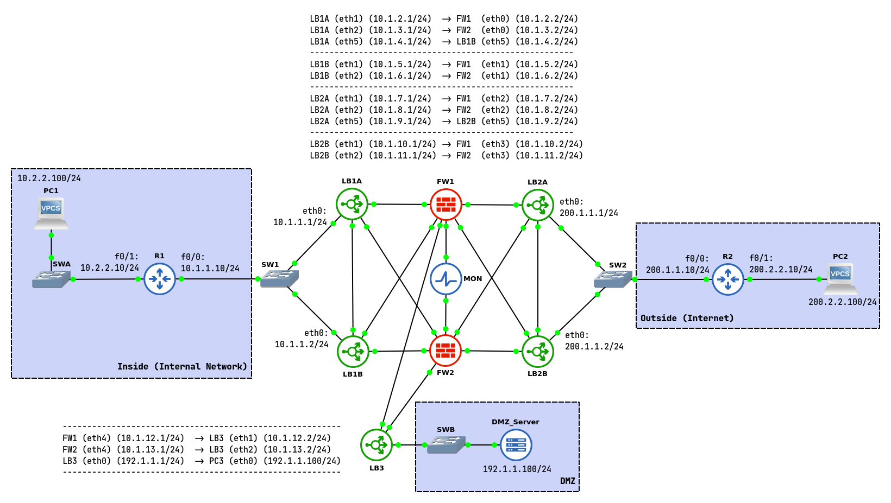

# High-Availability Firewall Scenarios (Load Balancing with Redundancy)



## R1 - Router Inside

```
configure terminal
interface f0/0
ip address 10.1.1.10 255.255.255.0
no shutdown
interface f0/1
ip address 10.2.2.10 255.255.255.0
no shutdown

ip route 0.0.0.0 0.0.0.0 10.1.1.1
ip route 0.0.0.0 0.0.0.0 10.1.1.2
```

## R2 - Router Outside

```
configure terminal
interface f0/0
ip address 200.1.1.10 255.255.255.0
no shutdown
interface f0/1
ip address 200.2.2.10 255.255.255.0
no shutdown

ip route 0.0.0.0 0.0.0.0 200.1.1.1
ip route 0.0.0.0 0.0.0.0 200.1.1.2
```

## LB1A

### Configure name, IPv4 address and static routing

```
set system host-name LB1A
set interfaces ethernet eth0 address 10.1.1.1/24
set interfaces ethernet eth1 address 10.1.2.1/24
set interfaces ethernet eth2 address 10.1.3.1/24
set interfaces ethernet eth5 address 10.1.4.1/24
set protocols static route 10.2.2.0/24 next-hop 10.1.1.10
```

### Configure load balancing service

```
set load-balancing wan interface-health eth1 nexthop 10.1.2.2
set load-balancing wan interface-health eth2 nexthop 10.1.3.2
set load-balancing wan rule 1 inbound-interface eth0
set load-balancing wan rule 1 interface eth1 weight 1
set load-balancing wan rule 1 interface eth2 weight 1
set load-balancing wan sticky-connections inbound
set load-balancing wan disable-source-nat
```

### Configure VRRP

```
set high-availability vrrp group LB1Cluster vrid 10
set high-availability vrrp group LB1Cluster interface eth5
set high-availability vrrp group LB1Cluster virtual-address 192.168.100.1/24
set high-availability vrrp sync-group LB1Cluster member LB1Cluster
set high-availability vrrp group LB1Cluster rfc3768-compatibility
```

### Configure conntrack-sync

```
set service conntrack-sync accept-protocol 'tcp,udp,icmp'
set service conntrack-sync failover-mechanism vrrp sync-group LB1Cluster
set service conntrack-sync interface eth5
set service conntrack-sync mcast-group 225.0.0.50
set service conntrack-sync disable-external-cache
```

## LB1B

### Configure name, IPv4 address and static routing

```
set system host-name LB1B
set interfaces ethernet eth0 address 10.1.1.2/24
set interfaces ethernet eth1 address 10.1.5.1/24
set interfaces ethernet eth2 address 10.1.6.1/24
set interfaces ethernet eth5 address 10.1.4.2/24
set protocols static route 10.2.2.0/24 next-hop 10.1.1.10
```

### Configure load balancing service

```
set load-balancing wan interface-health eth1 nexthop 10.1.5.2
set load-balancing wan interface-health eth2 nexthop 10.1.6.2
set load-balancing wan rule 1 inbound-interface eth0
set load-balancing wan rule 1 interface eth1 weight 1
set load-balancing wan rule 1 interface eth2 weight 1
set load-balancing wan sticky-connections inbound
set load-balancing wan disable-source-nat
```

### Configure VRRP

```
set high-availability vrrp group LB1Cluster vrid 10
set high-availability vrrp group LB1Cluster interface eth5
set high-availability vrrp group LB1Cluster virtual-address 192.168.100.1/24
set high-availability vrrp sync-group LB1Cluster member LB1Cluster
set high-availability vrrp group LB1Cluster rfc3768-compatibility
```

### Configure conntrack-sync

```
set service conntrack-sync accept-protocol 'tcp,udp,icmp'
set service conntrack-sync failover-mechanism vrrp sync-group LB1Cluster
set service conntrack-sync interface eth5
set service conntrack-sync mcast-group 225.0.0.50
set service conntrack-sync disable-external-cache
```

## LB2A

### Configure name, IPv4 address and static routing

```
set system host-name LB2A
set interfaces ethernet eth0 address 200.1.1.1/24
set interfaces ethernet eth1 address 10.1.7.1/24
set interfaces ethernet eth2 address 10.1.8.1/24
set interfaces ethernet eth5 address 10.1.9.1/24
set protocols static route 0.0.0.0/0 next-hop 200.1.1.10
```

### Configure load balancing service

```
set load-balancing wan interface-health eth1 nexthop 10.1.7.2
set load-balancing wan interface-health eth2 nexthop 10.1.8.2
set load-balancing wan rule 1 inbound-interface eth0
set load-balancing wan rule 1 interface eth1 weight 1
set load-balancing wan rule 1 interface eth2 weight 1
set load-balancing wan sticky-connections inbound
set load-balancing wan disable-source-nat
```

### Configure VRRP

```
set high-availability vrrp group LB2Cluster vrid 10
set high-availability vrrp group LB2Cluster interface eth5
set high-availability vrrp group LB2Cluster virtual-address 192.168.100.1/24
set high-availability vrrp sync-group LB2Cluster member LB2Cluster
set high-availability vrrp group LB2Cluster rfc3768-compatibility
```

### Configure conntrack-sync

```
set service conntrack-sync accept-protocol 'tcp,udp,icmp'
set service conntrack-sync failover-mechanism vrrp sync-group LB2Cluster
set service conntrack-sync interface eth5
set service conntrack-sync mcast-group 225.0.0.50
set service conntrack-sync disable-external-cache
```

## LB2B

### Configure name, IPv4 address and static routing

```
set system host-name LB2B
set interfaces ethernet eth0 address 200.1.1.2/24
set interfaces ethernet eth1 address 10.1.10.1/24
set interfaces ethernet eth2 address 10.1.11.1/24
set interfaces ethernet eth5 address 10.1.9.2/24
set protocols static route 0.0.0.0/0 next-hop 200.1.1.10   
```

### Configure load balancing service

```
set load-balancing wan interface-health eth1 nexthop 10.1.10.2
set load-balancing wan interface-health eth2 nexthop 10.1.11.2
set load-balancing wan rule 1 inbound-interface eth0
set load-balancing wan rule 1 interface eth1 weight 1
set load-balancing wan rule 1 interface eth2 weight 1
set load-balancing wan sticky-connections inbound
set load-balancing wan disable-source-nat
```

### Configure VRRP

```
set high-availability vrrp group LB2Cluster vrid 10
set high-availability vrrp group LB2Cluster interface eth5
set high-availability vrrp group LB2Cluster virtual-address 192.168.100.1/24
set high-availability vrrp sync-group LB2Cluster member LB2Cluster
set high-availability vrrp group LB2Cluster rfc3768-compatibility
```

### Configure conntrack-sync

```
set service conntrack-sync accept-protocol 'tcp,udp,icmp'
set service conntrack-sync failover-mechanism vrrp sync-group LB2Cluster
set service conntrack-sync interface eth5
set service conntrack-sync mcast-group 225.0.0.50
set service conntrack-sync disable-external-cache
```

## LB3 (DMZ)

### Configure name, IPv4 address and static routing

```
set system host-name LB3
set interfaces ethernet eth0 address 192.1.1.1/24
set interfaces ethernet eth1 address 10.1.12.2/24
set interfaces ethernet eth2 address 10.1.13.2/24
```

### Configure load balancing service

```
set load-balancing wan interface-health eth1 nexthop 10.1.12.1
set load-balancing wan interface-health eth2 nexthop 10.1.13.1
set load-balancing wan rule 1 inbound-interface eth0
set load-balancing wan rule 1 interface eth1 weight 1
set load-balancing wan rule 1 interface eth2 weight 1
set load-balancing wan sticky-connections inbound
set load-balancing wan disable-source-nat
```

## FW1

### Configure name, IPv4 address and static routing

```
set system host-name FW1
set interfaces ethernet eth0 address 10.1.2.2/24
set interfaces ethernet eth1 address 10.1.5.2/24
set interfaces ethernet eth2 address 10.1.7.2/24
set interfaces ethernet eth3 address 10.1.10.2/24
set interfaces ethernet eth4 address 10.1.12.1/24
set interfaces ethernet eth5 address 10.1.14.1/24
set protocols static route 0.0.0.0/0 next-hop 10.1.7.1
set protocols static route 0.0.0.0/0 next-hop 10.1.10.1
set protocols static route 10.2.2.0/24 next-hop 10.1.2.1
set protocols static route 10.2.2.0/24 next-hop 10.1.5.1
set protocols static route 192.1.1.0/24 next-hop 10.1.12.2
```

### Configure NAT/PAT mechanism

```
set nat source rule 10 outbound-interface eth2
set nat source rule 10 source address 10.0.0.0/8
set nat source rule 10 translation address 192.1.0.1-192.1.0.126

set nat source rule 20 outbound-interface eth3
set nat source rule 20 source address 10.0.0.0/8
set nat source rule 20 translation address 192.1.0.1-192.1.0.126
```

### Enable SSH

```
set service ssh listen-address 10.1.15.1
set service ssh port 22
```

### Configure flow control rule

```
set zone-policy zone INSIDE description "Inside (Internal Network)"
set zone-policy zone INSIDE interface eth0
set zone-policy zone INSIDE interface eth1

set zone-policy zone OUTSIDE description "Outside (Internet)"
set zone-policy zone OUTSIDE interface eth2
set zone-policy zone OUTSIDE interface eth3

set zone-policy zone DMZ description "DMZ"
set zone-policy zone DMZ interface eth4

set firewall name FROM-INSIDE-TO-OUTSIDE rule 10 action accept
set firewall name FROM-INSIDE-TO-OUTSIDE rule 10 protocol all
set firewall name FROM-INSIDE-TO-OUTSIDE rule 10 source address 10.2.2.0/24
set firewall name FROM-INSIDE-TO-OUTSIDE rule 10 destination address !10.2.2.0/24

set firewall name FROM-OUTSIDE-TO-INSIDE rule 10 action accept
set firewall name FROM-OUTSIDE-TO-INSIDE rule 10 state established enable
set firewall name FROM-OUTSIDE-TO-INSIDE rule 10 state related enable

set firewall name FROM-OUTSIDE-TO-DMZ rule 10 action accept
set firewall name FROM-OUTSIDE-TO-DMZ rule 10 state established enable
set firewall name FROM-OUTSIDE-TO-DMZ rule 10 state related enable

set firewall name FROM-OUTSIDE-TO-DMZ rule 20 description "Accept SSH,DNS,HTTP and HTTPS on ports 22,53,80 and 443"
set firewall name FROM-OUTSIDE-TO-DMZ rule 20 action accept
set firewall name FROM-OUTSIDE-TO-DMZ rule 20 protocol tcp_udp
set firewall name FROM-OUTSIDE-TO-DMZ rule 20 destination address 192.1.1.100
set firewall name FROM-OUTSIDE-TO-DMZ rule 20 destination port 22,53,80,443

set firewall name FROM-OUTSIDE-TO-DMZ rule 30 action drop
set firewall name FROM-OUTSIDE-TO-DMZ rule 30 protocol all
set firewall name FROM-OUTSIDE-TO-DMZ rule 30 destination address 192.1.1.100

set firewall name FROM-DMZ-TO-OUTSIDE rule 10 action accept
set firewall name FROM-DMZ-TO-OUTSIDE rule 10 protocol all
set firewall name FROM-DMZ-TO-OUTSIDE rule 10 source address 192.1.1.100
set firewall name FROM-DMZ-TO-OUTSIDE rule 10 destination address !10.2.2.0/24

set firewall name FROM-INSIDE-TO-DMZ rule 10 description "Accept SSH,DNS,HTTP and HTTPS on ports 22,53,80 and 443"
set firewall name FROM-INSIDE-TO-DMZ rule 10 action accept
set firewall name FROM-INSIDE-TO-DMZ rule 10 protocol tcp_udp
set firewall name FROM-INSIDE-TO-DMZ rule 10 source address 10.2.2.0/24
set firewall name FROM-INSIDE-TO-DMZ rule 10 destination address 192.1.1.100
set firewall name FROM-INSIDE-TO-DMZ rule 10 destination port 22,53,80,443

set firewall name FROM-DMZ-TO-INSIDE rule 10 action accept
set firewall name FROM-DMZ-TO-INSIDE rule 10 state established enable
set firewall name FROM-DMZ-TO-INSIDE rule 10 state related enable

set zone-policy zone INSIDE from OUTSIDE firewall name FROM-OUTSIDE-TO-INSIDE
set zone-policy zone OUTSIDE from INSIDE firewall name FROM-INSIDE-TO-OUTSIDE
set zone-policy zone DMZ from INSIDE firewall name FROM-INSIDE-TO-DMZ
set zone-policy zone INSIDE from DMZ firewall name FROM-DMZ-TO-INSIDE
set zone-policy zone DMZ from OUTSIDE firewall name FROM-OUTSIDE-TO-DMZ
set zone-policy zone OUTSIDE from DMZ firewall name FROM-DMZ-TO-OUTSIDE
```

## FW2

### Configure name, IPv4 address and static routing

```
set system host-name FW2
set interfaces ethernet eth0 address 10.1.3.2/24
set interfaces ethernet eth1 address 10.1.6.2/24
set interfaces ethernet eth2 address 10.1.8.2/24
set interfaces ethernet eth3 address 10.1.11.2/24
set interfaces ethernet eth4 address 10.1.13.1/24
set interfaces ethernet eth5 address 10.1.15.1/24
set protocols static route 0.0.0.0/0 next-hop 10.1.8.1
set protocols static route 0.0.0.0/0 next-hop 10.1.11.1
set protocols static route 10.2.2.0/24 next-hop 10.1.3.1
set protocols static route 10.2.2.0/24 next-hop 10.1.6.1
set protocols static route 192.1.1.0/24 next-hop 10.1.13.2
```

### Configure NAT/PAT mechanism

```
set nat source rule 10 outbound-interface eth2
set nat source rule 10 source address 10.0.0.0/8
set nat source rule 10 translation address 192.1.0.129-192.1.0.254

set nat source rule 20 outbound-interface eth3
set nat source rule 20 source address 10.0.0.0/8
set nat source rule 20 translation address 192.1.0.129-192.1.0.254
```

### Enable SSH

```
set service ssh listen-address 10.1.15.1
set service ssh port 22
```

### Configure flow control rule

```
set zone-policy zone INSIDE description "Inside (Internal Network)"
set zone-policy zone INSIDE interface eth0
set zone-policy zone INSIDE interface eth1

set zone-policy zone OUTSIDE description "Outside (Internet)"
set zone-policy zone OUTSIDE interface eth2
set zone-policy zone OUTSIDE interface eth3

set zone-policy zone DMZ description "DMZ"
set zone-policy zone DMZ interface eth4

set firewall name FROM-INSIDE-TO-OUTSIDE rule 10 action accept
set firewall name FROM-INSIDE-TO-OUTSIDE rule 10 protocol all
set firewall name FROM-INSIDE-TO-OUTSIDE rule 10 source address 10.2.2.0/24
set firewall name FROM-INSIDE-TO-OUTSIDE rule 10 destination address !10.2.2.0/24

set firewall name FROM-OUTSIDE-TO-INSIDE rule 10 action accept
set firewall name FROM-OUTSIDE-TO-INSIDE rule 10 state established enable
set firewall name FROM-OUTSIDE-TO-INSIDE rule 10 state related enable

set firewall name FROM-OUTSIDE-TO-DMZ rule 10 action accept
set firewall name FROM-OUTSIDE-TO-DMZ rule 10 state established enable
set firewall name FROM-OUTSIDE-TO-DMZ rule 10 state related enable

set firewall name FROM-OUTSIDE-TO-DMZ rule 20 description "Accept SSH,DNS,HTTP and HTTPS on ports 22,53,80 and 443"
set firewall name FROM-OUTSIDE-TO-DMZ rule 20 action accept
set firewall name FROM-OUTSIDE-TO-DMZ rule 20 protocol tcp_udp
set firewall name FROM-OUTSIDE-TO-DMZ rule 20 destination address 192.1.1.100
set firewall name FROM-OUTSIDE-TO-DMZ rule 20 destination port 22,53,80,443

set firewall name FROM-OUTSIDE-TO-DMZ rule 30 action drop
set firewall name FROM-OUTSIDE-TO-DMZ rule 30 protocol all
set firewall name FROM-OUTSIDE-TO-DMZ rule 30 destination address 192.1.1.100

set firewall name FROM-DMZ-TO-OUTSIDE rule 10 action accept
set firewall name FROM-DMZ-TO-OUTSIDE rule 10 protocol all
set firewall name FROM-DMZ-TO-OUTSIDE rule 10 source address 192.1.1.100
set firewall name FROM-DMZ-TO-OUTSIDE rule 10 destination address !10.2.2.0/24

set firewall name FROM-INSIDE-TO-DMZ rule 10 description "Accept SSH,DNS,HTTP and HTTPS on ports 22,53,80 and 443"
set firewall name FROM-INSIDE-TO-DMZ rule 10 action accept
set firewall name FROM-INSIDE-TO-DMZ rule 10 protocol tcp_udp
set firewall name FROM-INSIDE-TO-DMZ rule 10 source address 10.2.2.0/24
set firewall name FROM-INSIDE-TO-DMZ rule 10 destination address 192.1.1.100
set firewall name FROM-INSIDE-TO-DMZ rule 10 destination port 22,53,80,443

set firewall name FROM-DMZ-TO-INSIDE rule 10 action accept
set firewall name FROM-DMZ-TO-INSIDE rule 10 state established enable
set firewall name FROM-DMZ-TO-INSIDE rule 10 state related enable

set zone-policy zone INSIDE from OUTSIDE firewall name FROM-OUTSIDE-TO-INSIDE
set zone-policy zone OUTSIDE from INSIDE firewall name FROM-INSIDE-TO-OUTSIDE
set zone-policy zone DMZ from INSIDE firewall name FROM-INSIDE-TO-DMZ
set zone-policy zone INSIDE from DMZ firewall name FROM-DMZ-TO-INSIDE
set zone-policy zone DMZ from OUTSIDE firewall name FROM-OUTSIDE-TO-DMZ
set zone-policy zone OUTSIDE from DMZ firewall name FROM-DMZ-TO-OUTSIDE
```
